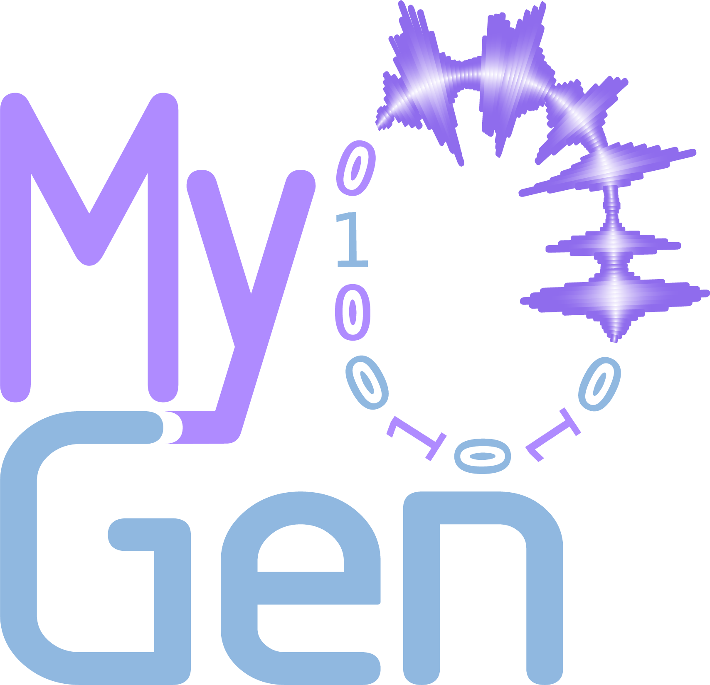

> [!TIP]
> Dive deeper into our features and usage with the official [documentation](https://nsquaredlab.github.io/MyoGen/).

# MyoGen - EMG simulation made accessible

## What is MyoGen?

MyoGen is a biophysical simulation toolkit for generating surface and intramuscular electromyography (EMG) signals. Built on established physiological principles and validated anatomical data, MyoGen provides researchers, engineers, and educators with an accessible platform for EMG signal simulation that spans from motor unit recruitment to surface electrode recordings.

The toolkit implements a complete simulation pipeline: from motor unit recruitment thresholds and spike train generation using the NEURON simulator, through anatomically accurate muscle modeling with realistic fiber distributions, to surface EMG signal synthesis via Motor Unit Action Potentials (MUAPs). This end-to-end approach enables users to understand and validate EMG processing algorithms, develop new analysis methods, and explore neuromuscular system behavior under various conditions.

Key features include:
- **Motor Unit Recruitment Modeling**: Four validated models (Fuglevand, De Luca, Konstantin, Combined) for physiologically realistic recruitment patterns
- **Biophysical Spike Train Simulation**: NEURON-based motor neuron modeling with detailed calcium dynamics and membrane properties  
- **Anatomically Accurate Muscle Models**: Spatial distribution of motor units and muscle fibers based on anatomical measurements
- **Surface EMG Synthesis**: Multi-layered volume conductor modeling for realistic surface EMG signal generation
- **Multi-Electrode Array Support**: Simulation of high-density electrode grids with configurable spatial arrangements
- **Flexible Input Current Patterns**: Built-in generators for sinusoidal, ramp, step, trapezoid, and sawtooth stimulation waveforms
- **GPU Acceleration**: Automatic CuPy integration for fast parallel processing of large-scale simulations
- **Comprehensive Visualization**: Built-in plotting tools for recruitment thresholds, spike trains, muscle anatomy, MUAPs, and surface EMG
- **Reproducible Research**: Deterministic random number generation and parameter saving for reproducible simulations

> [!WARNING]  
> MyoGen is still under development and the API is subject to change.

## Installation

### Clone the repository
```bash
git clone https://github.com/NsquaredLab/MyoGen.git
cd MyoGen
```

### (Windows only) Install NEURON 8.2.6

> [!WARNING]  
> Make sure to install version 8.2.6.

Link: https://github.com/neuronsimulator/nrn/releases/download/8.2.6/nrn-8.2.6.w64-mingw-py-38-39-310-311-312-setup.exe

### Install UV
https://docs.astral.sh/uv/#highlights

### Create environment
```bash
uv sync
```

### Add cupy if CUDA is available
```bash
uv pip install cupy-cuda12x
```

### Activate the environment
```bash
source .venv/bin/activate
```

### Run the setup to compile the NMODL files correctly
> [!WARNING]  
> This step is required. Please do not skip it.

```bash
python -c "from myogen.utils import setup_myogen; setup_myogen()"
```

#### NMODL/NEURON Issues

If you encounter NMODL compilation or loading issues:

1. **Automatic handling**: MyoGen automatically handles NMODL loading. Just import and use:
   ```python
   from myogen import simulator  # NMODL files loaded automatically
   ```

2. **Manual setup** (if needed):
   ```python
   from myogen.utils import setup_myogen
   setup_myogen()  # Explicit setup with verbose output
   from myogen import simulator
   ```

3. **Force recompilation**:
   ```python
   from myogen.utils import setup_myogen
   setup_myogen(force_nmodl_reload=True)  # Force recompilation
   ```

## How to Use

See the [documentation](https://nsquaredlab.github.io/MyoGen/) for more details.

